# **«Система проверки знаний»** — Программное обеспечение для создания и прохождения тестов

**Статус:** Курсовая работа по дисциплине «Создание RAD-приложений»  
**Цель:** Проектирование и разработка приложения для создания, редактирования и прохождения тестов с разделением ролей пользователей.

---

## 📌 **О проекте**

«Система проверки знаний» — это программная система, разработанная для организации тестирования пользователей. Приложение предоставляет различные роли: **администратор**, **создатель тестов** и **тестируемый**, каждая из которых обладает своим функционалом.

**Ключевые возможности:**
*   **Регистрация и авторизация** пользователей с различными ролями.
*   **Создание, редактирование и удаление** тестов и вопросов различных типов (один из списка, несколько из списка, текстовый ответ).
*   **Прохождение тестов** с сохранением результатов.
*   **Просмотр истории прохождения** тестов.
*   **Управление пользователями** для администраторов.

---

## 🗂️ **Структура репозитория**

```
├── README.md                     # Основная документация проекта
├── admin.py                      # Панель администратора
├── create_test_base.py           # Форма создания/редактирования теста
├── create_test_questions.py      # Форма создания/редактирования вопросов
├── db.py                         # Модуль работы с базой данных PostgreSQL
├── history.py                    # История прохождения тестов
├── menu_test_teach.py            # Главное окно программы (разные роли)
├── register_form.py              # Форма авторизации и регистрации
├── test.py                       # Логика тестирования и создания тестов
├── requirements.txt              # Список зависимостей Python
├── planning.db                   # Файл базы данных SQLite
└── screenshots/                  # Папка со скриншотами интерфейса
```

---

## 🖥️ **Демонстрация интерфейса**

### Форма авторизации
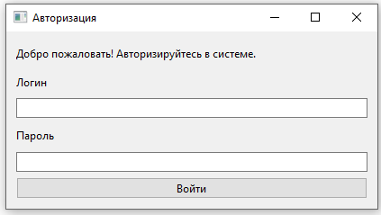

### Главное окно для администратора
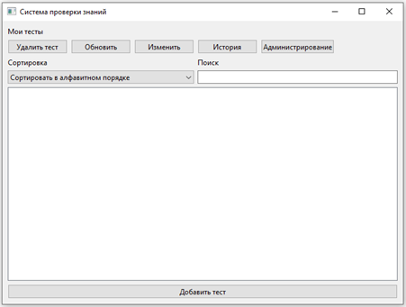

### Панель администрирования
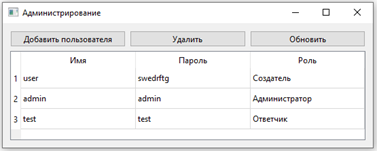

---

## ⚙️ **Технологический стек и архитектура**

*   **Язык программирования:** Python 3.12
*   **GUI-библиотека:** PyQt6
*   **База данных:** PostgreSQL 16
*   **Проектирование интерфейса:** Qt Designer 4.5
*   **Архитектура:** RAD-подход с разделением на слои:
    *   `db.py` — слой доступа к данным (DAO)
    *   Модели (`User`, `Test`, `Question`) — бизнес-логика
    *   Окна приложения (`admin.py`, `test.py` и др.) — представление и контроллер

---

## 👥 **Роли пользователей и их возможности**

### 1. **Администратор**
*   Управление пользователями (добавление, редактирование, удаление)
*   Все возможности создателя тестов
*   Просмотр истории прохождения всех тестов

### 2. **Создатель тестов**
*   Создание, редактирование и удаление тестов
*   Добавление вопросов различных типов
*   Просмотр результатов прохождения своих тестов
*   Редактирование названия теста

### 3. **Тестируемый**
*   Просмотр списка доступных тестов
*   Поиск и сортировка тестов
*   Прохождение тестов
*   Просмотр своих результатов

---

## 🛠️ **Создание теста**

### Шаг 1: Добавление нового теста
1. На главном окне нажмите кнопку **"Добавить тест"**
2. В открывшемся окне введите **название теста**
3. Нажмите кнопку **"Сохранить"**

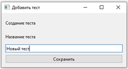

*Рисунок: Форма для создания нового теста*

### Шаг 2: Интерфейс управления тестом
После сохранения названия откроется окно управления тестом:

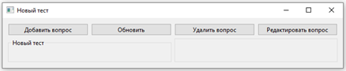

*Рисунок: Основное окно для наполнения теста вопросами*

### Шаг 3: Создание вопроса
1. Нажмите **"Добавить вопрос"**
2. Заполните форму создания вопроса:

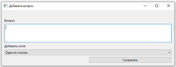

*Рисунок: Форма для создания нового вопроса*

### Шаг 4: Пример заполненного вопроса
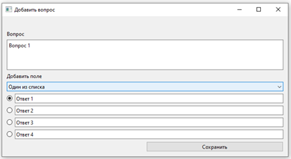

*Рисунок: Пример заполнения вопроса с вариантами ответов*

### Шаг 5: Отображение созданного вопроса
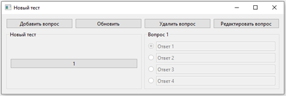

*Рисунок: Как выглядит вопрос после добавления в тест*

### Шаг 6: Редактирование вопроса
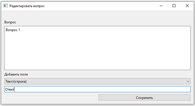

*Рисунок: Форма для редактирования существующего вопроса*

### Шаг 7: Отображение отредактированного вопроса
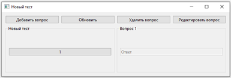

*Рисунок: Результат редактирования вопроса*

### Шаг 8: Полностью заполненный тест


*Рисунок: Тест с несколькими добавленными вопросами*

### Шаг 9: Главное окно с добавленным тестом
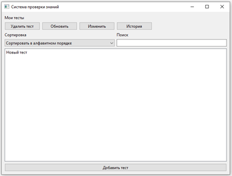

*Рисунок: Тест появился в списке доступных тестов*

---

## 📝 **Прохождение теста**

### Шаг 1: Форма для прохождения теста
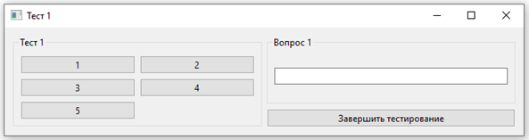

*Рисунок: Интерфейс прохождения теста с вопросами и вариантами ответов*

### Шаг 2: Процесс тестирования
1. Выбирайте ответы на вопросы
2. Навигация между вопросами через кнопки слева
3. Отвеченные вопросы подсвечиваются зеленым

### Шаг 3: Завершение тестирования
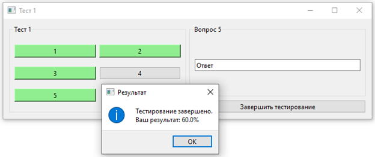

*Рисунок: Окно с результатом тестирования в процентах*

### Шаг 4: Результат теста
После завершения тестирования:
- Результат сохраняется в базе данных
- Пройденный тест выделяется в списке
- Создатель теста может просмотреть результаты

---

## 📊 **Система оценивания**

### Подсчет результатов:
1. **Вопросы с выбором ответа**:
   *   **"Один из списка"** — 1 балл за полностью правильный ответ
   *   **"Несколько из списка"** — 1 балл за полностью правильный набор ответов
   
2. **Текстовые вопросы**:
   *   **"Текст(строка)"** — 1 балл за точное совпадение с правильным ответом

3. **Расчет процента**:
   ```
   Процент = (Количество правильных ответов / Общее количество вопросов) × 100%
   ```

---

## 🚀 **Запуск приложения**

### 1. Установка зависимостей:
```bash
pip install PyQt6 psycopg2
```

### 2. Настройка базы данных PostgreSQL:
* Создайте базу данных `tests`
* Настройте подключение в файле `db.py` (хост, имя пользователя, пароль, порт)
* Создайте таблицы согласно схеме

### 3. Запуск приложения:
```bash
python register_form.py
```

### 4. Тестовые пользователи (после настройки БД):
* **Администратор:** логин и пароль по умолчанию
* **Создатель тестов:** необходимо создать через панель администратора
* **Тестируемый:** необходимо создать через панель администратора
*   Предоставляет удобный интерфейс для создания и прохождения тестов
*   Реализует разграничение прав доступа по ролям
*   Обеспечивает надежное хранение данных в базе PostgreSQL
*   Обладает всеми заявленными функциями и проходит тестирование
